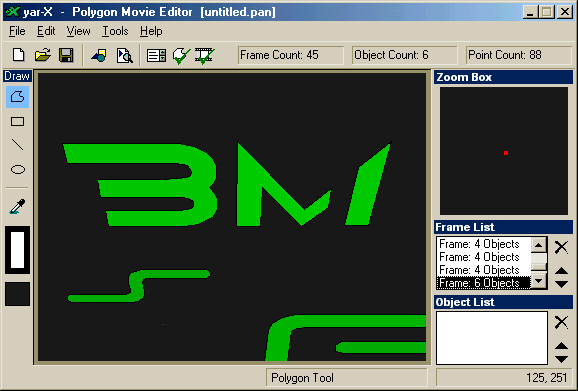



## Polygon Animation Editor \(PAN File Editor\)

### Description

PAN files are best described as an animated version of a Windows Meta File. Each frame of the animation is composed of shapes, be it Rectangles, Ellipses, Lines or freehand Polygons. This animation system is implimented widely in my upcomming game 'BotMatch - Secondary Protocal' which I will be submitting to PSC on September 6th. Polygon Animation Files (PAN Files) are compact (an 80 frame animation can be less then 10KB depending on the number of points that are used to create the polygons).

I have included several sample PAN files found in the 'samples' folder... These 3D looking animations were all 'traced' frame-by-frame from quality rendered animations...

Tracing can be done by clicking on the image button on the toolbar, or selecting the tracing option from the menu... You load a picture into the background to use as a reference for drawing over, thus giving you the ability to create complex, stunning animations with an extremely economical filesize.

Keep this submission in mind if you get the chance to look at my game on which will be submitted on September 6th.
 
### More Info
 

             |
---                |---
**Submitted On**   |2003-05-30 15:49:04
**By**             |[\(Tim Miron\) yar\-interactive software](https://github.com/Planet-Source-Code/PSCIndex/blob/master/ByAuthor/tim-miron-yar-interactive-software.md)
**Level**          |Intermediate
**User Rating**    |4.9 (44 globes from 9 users)
**Compatibility**  |VB 5\.0, VB 6\.0
**Category**       |[Graphics](https://github.com/Planet-Source-Code/PSCIndex/blob/master/ByCategory/graphics__1-46.md)
**World**          |[Visual Basic](https://github.com/Planet-Source-Code/PSCIndex/blob/master/ByWorld/visual-basic.md)
**Archive File**   |[Polygon\_An1632308202003\.zip](https://github.com/Planet-Source-Code/tim-miron-yar-interactive-software-polygon-animation-editor-pan-file-editor__1-47838/archive/master.zip)

